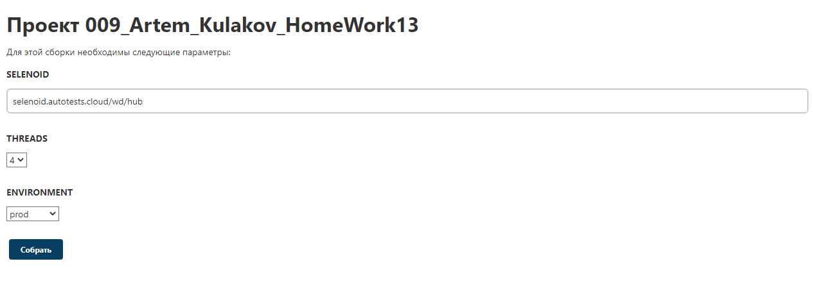
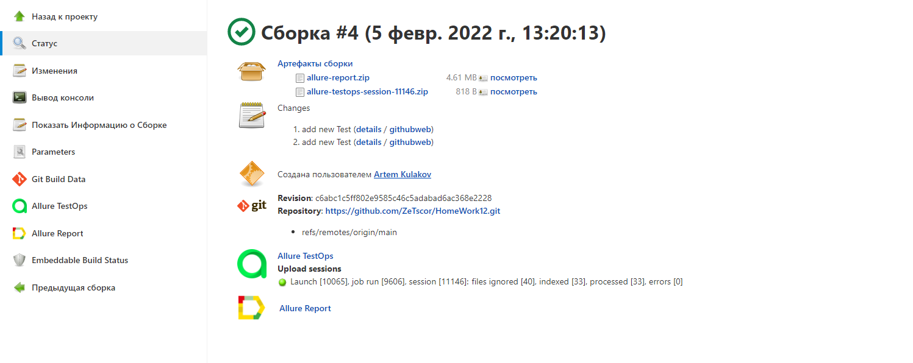
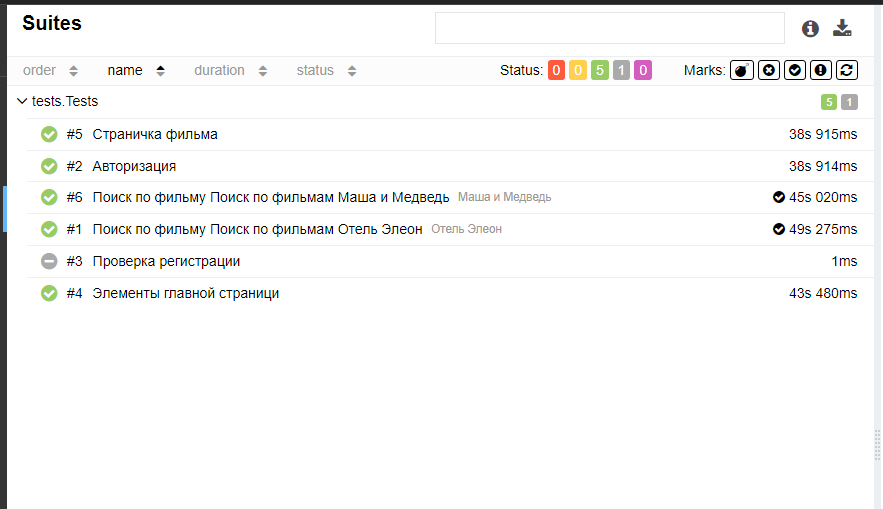
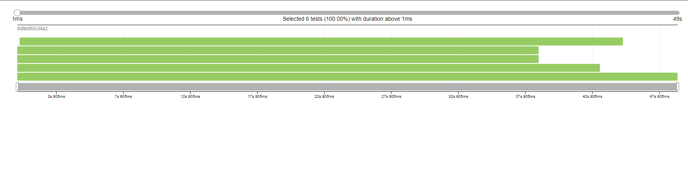
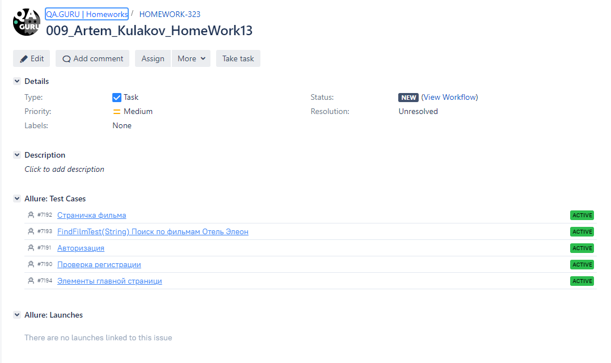
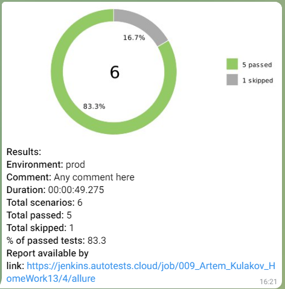

# Проект по разработке автотестов для интернет-кинотеатра [START](https://start.ru/ "START")
### Технологический стек
________
           

-----
* Автотесты написаны на ``Java`` с использованием фреймворка ``Selenide``.
* ``JUnit 5`` фреймворк для модульного тестирования.
* ``Gradle`` используется для автоматизированной сборки проекта.
* С помощью ``Jenkins`` выполняется запуск тестов.
* ``Selenoid`` выполняет запуск браузеров в контейнерах ``Docker``.
* ``Allure Report`` формирует отчет о запуске тестов.
* Автотесты интегрируются с тест-менеджмент системой ``Allure TestOps`` и таск-трекер системой ``Jira``
* В ``Telegram`` бот отправляет уведомления о результатах прохождения тестов.

### ✅  Реализованы следующие тест-кейсы
2. Проверка наличия элементов главной страници
3. Проверка функции поиска фильмов на сайте.
4. Проверка авторизации до запроса капчи.
5. Проверка наличия элементов на страници фильма.
6. Проверка регистрации.

### 🚀 Запуск тестов из терминала
* Локально ``gradle clean properties_test-Dselenoid=selenoid.autotests.cloud/wd/hub-Dthreads=5``

###  Конфигурация Job в Jenkins 
🔴 Открыть сборку [Jenkins](https://jenkins.autotests.cloud/job/009_Artem_Kulakov_HomeWork13/).  
🔴 Нажать **"Собрать с параметрами"**.  
🔴 Указать необходимые параметры.  
🔴 Нажать на кнопку **"Собрать"**.  

  

🔴 Для формирования отчета о прохождении тестов в Allure Report необходимо нажать на ссылку/иконку **"Allure Report"**.  

  

###  Отчет о результатах тестирования в Allure Report

  
Подробнее
  
  
**1.** Страница «Suites».  

На данной странице представляется распределение выполнявшихся тестов по тестовым наборам или классам, в которых находятся тестовые методы.

  

**2.** Страница «Timeline».  

Данная страница визуализирует временные рамки прохождения каждого теста.  

  

  

###  Интеграция тестов c тест-менеджмент системой [Allure TestOps](https://allure.autotests.cloud/project/996/dashboards)

  
Подробнее
 

  
📎 **Dashboards.**  

  
  
  

###  Интеграция тестов c таск-трекер системой [Jira](https://jira.autotests.cloud/browse/HOMEWORK-323)  

  
 

###  Уведомления о прохождении тестов в Telegram  

  
